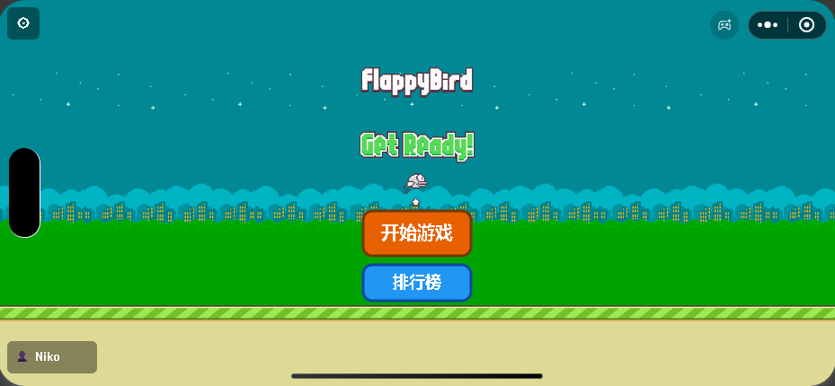
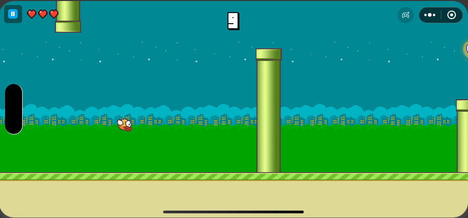
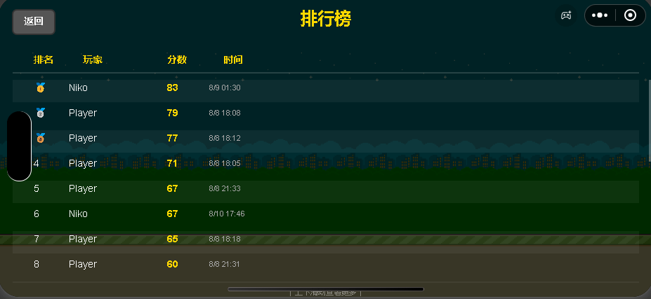

# Flappy Bird 微信小游戏

基于微信小游戏平台开发的 Flappy Bird 风格游戏，采用**前端本地运行 + 后端 C# API** 的混合架构。

## 截图

| 主页 | 游戏进行中 | 排行榜 |
|:---:|:---:|:---:|
|  |  |  |

## 技术栈

| 层级 | 技术 |
|:---|:---|
| 前端 | 微信小游戏 (JavaScript + Canvas) |
| 后端 | C# / .NET 8 + ASP.NET Core Web API |
| 数据库 | PostgreSQL + Entity Framework Core |
| 测试 | Newman (Postman CLI) / Python |

## 架构设计

游戏核心逻辑（物理引擎、碰撞检测、水管/道具生成）在**手机本地运行**，确保 60fps 流畅体验。后端仅负责分数存储和排行榜查询，有网络就用，没网络也能正常玩游戏。

```
┌─────────────────────┐     ┌─────────────────────┐
│   微信小游戏前端      │     │   C# 后端 API        │
│                     │     │                     │
│  • 游戏物理引擎      │────▶│  • 分数提交           │
│  • 碰撞检测          │     │  • 排行榜查询         │
│  • 道具/障碍物系统    │◀────│  • 数据持久化         │
│  • 音效播放          │     │                     │
└─────────────────────┘     └──────────┬──────────┘
                                       │
                            ┌──────────▼──────────┐
                            │     PostgreSQL       │
                            │     (本地数据库)       │
                            └─────────────────────┘
```

## 功能特性

- **经典 Flappy Bird 玩法** — 点击屏幕让小鸟飞起，躲避水管
- **3 条命机制** — 碰撞后不会立即死亡，有短暂无敌帧，护盾可抵挡一次碰撞
- **动态难度曲线** — 分数越高，水管越密、速度越快、间隙越小；难度每 5 分提升一级
- **道具系统**：护盾（金色光环，抵挡一次碰撞）、双倍分数（x2 持续 6 秒）
- **障碍物**：
  - **圆锯** — 5 分后出现，吸附在水管间隙中旋转，可被护盾抵挡
  - **火箭** — 10 分后出现，追踪玩家位置后直线飞射，带有尾气粒子特效
- **移动水管** — 部分水管会上下浮动，增加难度
- **小鸟皮肤** — 蓝、黄、红三种随机切换
- **排行榜** — 支持滚动浏览，前三名金/银/铜奖牌显示
- **本地最高分** — 离线也能记录
- **设置面板** — 音量调节（主音量、BGM、SFX 独立控制）、振动开关、玩家昵称修改
- **玩家昵称** — 支持自定义昵称（3-10 字符），弹出系统键盘输入，本地缓存

## 项目结构

```
Flappy-Bird/
├── front/                        # 微信小游戏前端
│   ├── game.js                   # 入口文件
│   ├── game.json                 # 游戏配置（横屏）
│   ├── project.config.json       # 微信开发者工具配置
│   ├── js/
│   │   ├── main.js               # 主循环 + 游戏逻辑（帧率控制、状态管理）
│   │   ├── config.js             # 游戏参数配置（难度、道具、音效等）
│   │   ├── databus.js            # 全局状态管理（对象池、分数、道具状态）
│   │   ├── api.js                # 后端 API 通信
│   │   ├── render.js             # Canvas 渲染初始化（设计分辨率 932×430）
│   │   ├── sound.js              # 音效管理（预加载、播放控制）
│   │   ├── base/
│   │   │   ├── sprite.js         # 精灵基类
│   │   │   └── pool.js           # 对象池（水管/道具/锯片/火箭复用）
│   │   ├── player/
│   │   │   └── index.js          # 玩家（小鸟：物理、碰撞、护盾渲染）
│   │   ├── npc/
│   │   │   ├── pipe.js           # 水管障碍物（含移动水管）
│   │   │   ├── prop.js           # 道具（护盾、双倍分数）
│   │   │   ├── saw.js            # 圆锯障碍物（旋转吸附在水管间隙）
│   │   │   └── rocket.js         # 火箭障碍物（追踪→直线飞射）
│   │   └── runtime/
│   │       ├── background.js     # 背景/地面渲染（全屏适配）
│   │       └── gameinfo.js       # UI 渲染 + 触摸事件（主页、排行榜、设置、昵称对话框）
│   ├── images/                   # 图片资源
│   └── audio/                    # 音效资源
│
├── back/back/                    # C# 后端 API
│   ├── Controllers/
│   │   ├── GameController.cs     # 游戏 API（旧版服务端模式，保留兼容）
│   │   └── ScoreController.cs    # 分数/排行榜 API
│   ├── Services/
│   │   ├── GameService.cs        # 游戏逻辑（旧版服务端模式）
│   │   └── ScoreService.cs       # 分数服务
│   ├── Models/
│   │   ├── GameModels.cs         # 游戏数据模型
│   │   └── DTOs.cs               # 数据传输对象
│   ├── Data/
│   │   └── AppDbContext.cs       # EF Core 数据库上下文
│   ├── postman/                  # Postman API 测试集合
│   ├── sql/init.sql              # 数据库初始化脚本
│   └── Program.cs                # 应用入口
│
├── test_props.py                 # 道具位置验证脚本（Python）
├── test_api.ps1                  # 后端 API 自动化测试脚本（PowerShell）
└── AGENTS.md                     # 项目开发规范
```

## 快速开始

### 环境要求

- [微信开发者工具](https://developers.weixin.qq.com/miniprogram/dev/devtools/download.html)
- [.NET 8 SDK](https://dotnet.microsoft.com/download/dotnet/8.0)
- [PostgreSQL](https://www.postgresql.org/download/) 15+
- Node.js（用于 Newman 自动化测试，可选）

### 1. 数据库初始化

```sql
-- 在 PostgreSQL 中创建数据库
CREATE DATABASE flappy_db;

-- 运行初始化脚本
psql -U postgres -d flappy_db -f back/back/sql/init.sql
```

### 2. 配置后端

编辑 `back/back/appsettings.Development.json`，填入你的 PostgreSQL 密码：

```json
{
  "ConnectionStrings": {
    "DefaultConnection": "Host=localhost;Port=5432;Database=flappy_db;Username=postgres;Password=你的密码"
  }
}
```

### 3. 启动后端

```bash
cd back/back
dotnet run
```

后端默认监听 `http://localhost:5205`。

### 4. 启动前端

1. 打开**微信开发者工具**
2. 导入项目 → 选择 `front/` 目录
3. 填入你的 AppID（或使用测试号）
4. 模拟器调试：`api.js` 中 `DEV_IP` 设为 `localhost`
5. 真机调试：`DEV_IP` 设为电脑局域网 IP，手机和电脑连接同一 WiFi

### 5. 真机调试配置

```javascript
// front/js/api.js 第 14 行
const DEV_IP = '你的电脑IP';  // 改为你的电脑 IP
```

防火墙放行端口（管理员 PowerShell）：

```powershell
netsh advfirewall firewall add rule name="FlappyBird" dir=in action=allow protocol=TCP localport=5205
```

## API 接口

| 方法 | 路径 | 说明 |
|:---|:---|:---|
| POST | `/api/score` | 提交分数 |
| GET | `/api/score?limit=10` | 获取排行榜（最多 20 名） |
| POST | `/api/score/cleanup` | 清理测试数据（按玩家名称列表删除） |
| POST | `/api/game/start` | 开始游戏（旧版服务端模式） |
| POST | `/api/game/{id}/tick` | 游戏帧推进（旧版） |
| POST | `/api/game/{id}/flap` | 跳跃（旧版） |

## 难度参数

| 参数 | 初始值 | 最终值 | 说明 |
|:---|:---|:---|:---|
| SPEED_BASE | 3 | 6.5 | 基础速度 / 最大速度 |
| GAP_BASE | 130 | 85 | 基础间隙 / 最小间隙 |
| INTERVAL_BASE | 100 | 60 | 基础水管间距 / 最小间距 |
| DIFFICULTY_STEP | 5 | - | 每 5 分提升一级难度 |
| SAW_MIN_SCORE | 5 | - | 圆锯 5 分后开始出现 |
| ROCKET_MIN_SCORE | 10 | - | 火箭 10 分后开始出现 |
| SAW_SPAWN_CHANCE | 45% | - | 每个水管附带圆锯概率 |
| ROCKET_SPAWN_CHANCE | 40% | - | 每个水管附带火箭概率 |
| SHIELD_DURATION | 300帧(5秒) | - | 护盾持续时间 |
| MULTIPLIER_DURATION | 360帧(6秒) | - | 双倍分数持续时间 |

## 自动化测试

### Newman (Postman CLI)

```bash
cd back/back
npx newman run postman/FlappyBird_API_Collection.json
```

### API 测试（PowerShell）

```powershell
.\test_api.ps1          # 测试所有 API 接口，完成后自动清理测试数据
```

### 道具位置验证

```bash
python test_props.py          # 默认 200 轮
python test_props.py 500      # 自定义轮数
```

## 许可证

MIT